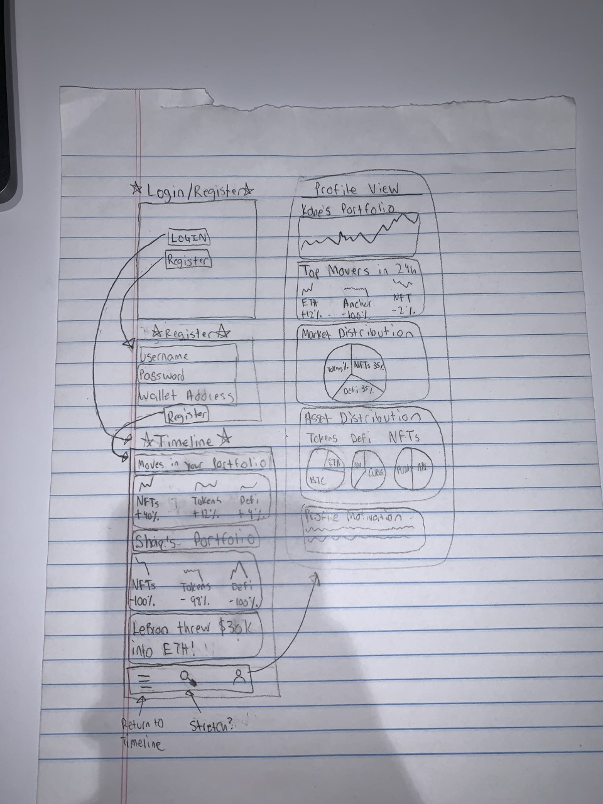

Original App Design Project - README Template
===

# WalletWatcher

## Table of Contents
1. [Overview](#Overview)
1. [Product Spec](#Product-Spec)
1. [Wireframes](#Wireframes)
2. [Schema](#Schema)

## Overview
### Description
[Description of your app]
This mobile application tracks crytpo portfolios in a social media like fashion. It displays the various assets that a user has invested in and allows for comments to be posted along with updates on each investment decison made.

### App Evaluation
[Evaluation of your app across the following attributes]
- **Category:**
Social, Education
- **Mobile:**
Push, real-time, 
- **Story:**
The value of this application is being able to visualize all assets in a crypto portfolio, view other people's portfolios, and discuss portfolios in a manner like a social media application.

To friends and peers, this idea would lead to a good response because of the value that it adds and the necessity that it fills.
- **Market:**
The size of the market is anyone that is invested in cryptocurrency, which is a considerable amount of people given that a Pew Research Center survey showed that 16% of US adults said they personally have invested in, traded or otherwise used a cryptocurrency.

This application provides value to the niche of people who would like to track all of their assets in one place and learn about other people's porfolios, which is quite a well-defined audience.
- **Habit:**
A user would check this app 3-4 times a day to keep up with other portfolios and track their investments. This is possible by using push notifications about changes in a portfolio, a new comment made on a given portfolio, and updates based on market voltatility. The average user can either consume or create, the point of the application is to allow people to share their experiences and those that are just starting out can learn from those that have more experience and are already invested.
- **Scope:**
The technical difficulty of this application is the right amount to finish before the end of the project. A stripped down version of this application is still interesting to build because it displays all crytpo assets in one place. The project that I want to build is clearly defined and attainable.

## Product Spec

### 1. User Stories (Required and Optional)

**Required Must-have Stories**

* Login
* Home page (scroll view of personal protfolio updates, other people's udpates?, and asset changes)
* Personal portfolio page

**Optional Nice-to-have Stories**

* Explore Page
* Favorite/follow portfolios
* Post comments on portfolios
* Post comments on portfolio movement
* Transaction history
* Multichain compatability

### 2. Screen Archetypes

* Login
* Register
    * Upon Download/Reopening of the application, the user is prompted to log in to gain access to their profile information to be properly matched with another person.
* Timeline
    * Show personal portfolio changes
    * Show personal asset price changes
    * Show other portfolio changes
    * Show other posts/comments on price changes & portfolios
* My Profile
    * View all of users assets
        * Tokens
        * NFTs
    * View portfolio comments
    * Visualize portfolio balance over time
    * Show recent transactions
    * Show top movers in portfolio
    * Show asset distribution

### 3. Navigation

**Tab Navigation** (Tab to Screen)

* Timeline (home screen)
* My Profile (user portfolio view)
* Search (to find specific users)
* Search Results (to show the users matching a certain criteria)
* General profile view

**Flow Navigation** (Screen to Screen)

* Forced Log-in -> Account creation if no log in is available
* Timeline
* My Profile
* Search -> Search Results -> Profile

## Wireframes


### [BONUS] Digital Wireframes & Mockups

### [BONUS] Interactive Prototype

## Schema 
[This section will be completed in Unit 9]

### Models

Model - User
| Property | Type   | Description                                |
|----------|--------|--------------------------------------------|
| username | string | A user's chosen username                   |
| password | string | A user's chosen password for their account |

Model - Wallet
| Property      | Type            | Description                                                      |
|---------------|-----------------|------------------------------------------------------------------|
| owner         | Pointer to User | Pointer to the User object that is the owner of the given wallet |
| walletAddress | String          | A string of the wallet address                                   |
| symbol        | String          | The symbol of the crypto token that the address pertains to      |

### Networking
* Profile View
   * (Read/GET) Query all wallets that the user is the owner of
   ```
   posts.query('cheese')
   ```
- [Create basic snippets for each Parse network request]
- [OPTIONAL: List endpoints if using existing API such as Yelp]
